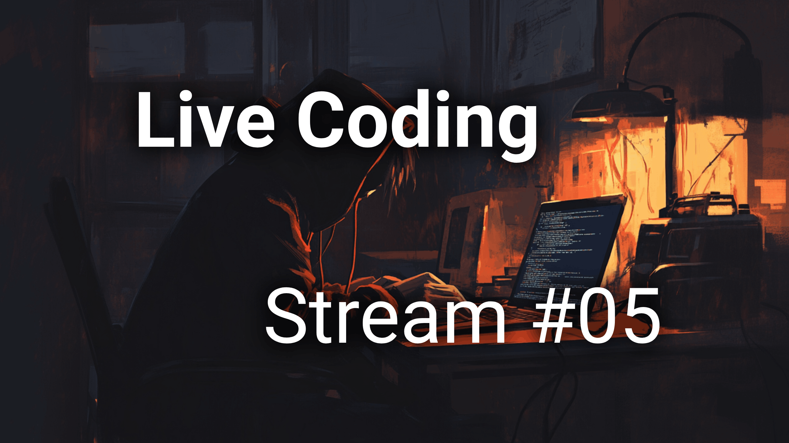

# 💣 Minesweeper in React + TypeScript

Це реалізація класичної гри **Minesweeper (Сапер)**, створена в реальному часі під час стріму на YouTube 🎥

> 🔴 **Код зі стріму "Live Coding #05 — Небезпечна гра з React та TypeScript"**



---

## 🕹️ Про гру

- Реалізовано на **React + TypeScript**
- Без бібліотек, шаблонів чи UI-фреймворків
- Рекурсивне відкриття клітинок (flood fill)
- Позначення мін прапорцями (right click)
- Смарт-логіка: автоперевірка сусідів, підсвітка клітинок
- Обробка перемоги та поразки

---

## 📺 Дивись стрім

[➡️ Перейти до стріму на YouTube](https://youtube.com/live/KBO-aykbWkM?feature=share)

---

## 🚀 Як запустити

```bash
git clone https://github.com/leva13007/minesweeper.git
cd minesweeper
npm install
npm run dev
```


⸻

🧠 Цілі стріму:
* Показати як мислить розробник у реальному часі
* Попрактикуватися в роботі з станом у React
* Попрацювати з алгоритмами (рекурсія, flood fill, логіка перевірок)
* Отримати задоволення від створення гри з нуля

⸻

🧩 Плановані фічі (можливо після стріму):
* Кнопка “Нова гра”
* Адаптивна складність (easy / normal / hard)
* Таймер і лічильник прапорців
* Анімація відкриття клітинок
* Темна тема 🌙

⸻

📦 Ліцензія

MIT — користуйся, змінюй, вивчай. І не забудь залишити ⭐️, якщо було корисно 😉

⸻

📣 Хештеги

#nocourse #livecoding #react #typescript #minesweeper
